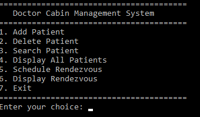

# Doctor Cabin Management System

Welcome, students! If you find this project useful, don't forget to leave a star. Thank you! <3

A **console-based application** built in C for managing patient records and scheduling appointments in a doctor's cabin. It utilizes **linked lists** for dynamic data storage and **file handling** to ensure data persistence.

---

## Screenshot



---

## Table of Contents
- [Features](#features)
- [Technologies](#technologies)
- [How to Run](#how-to-run)
- [Usage](#usage)
- [Contributing](#contributing)
- [License](#license)

---

## Features
- **Patient Management**:
  - Add, delete, search, and display patients.
- **Appointment Management**:
  - Schedule and display appointments.
- **File Persistence**:
  - Data is saved to `patients.txt` and `appointments.txt`.
- **Menu-Driven Interface**:
  - Simple and intuitive text-based menu.

---

## Technologies
- **C Programming Language**
- **Linked Lists** for dynamic data management.
- **File I/O** for saving and loading data.

---

## How to Run
1. Clone the repository:
   ```bash
   git clone https://github.com/dissojak/DoctorCabin_Proj_C.git
   ```
2. Run the Program:
```bash
   DoctorCabinManagement.exe
```
---

## Usage
Use the menu to:
- Add, delete, search, and display patients.
- Schedule and display appointments.

Data is automatically saved to `patients.txt` and `appointments.txt` when the program exits.

---

## Contributing
Contributions are welcome! Open an issue or submit a pull request.

---

## License
This project is licensed under the **MIT License**. See [LICENSE](LICENSE) for details.

